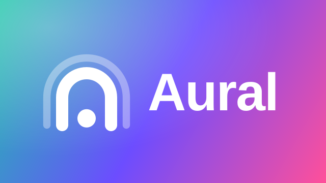
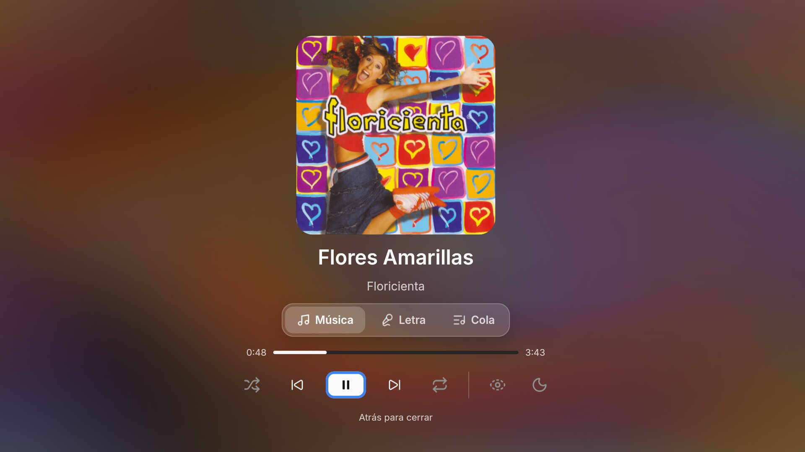
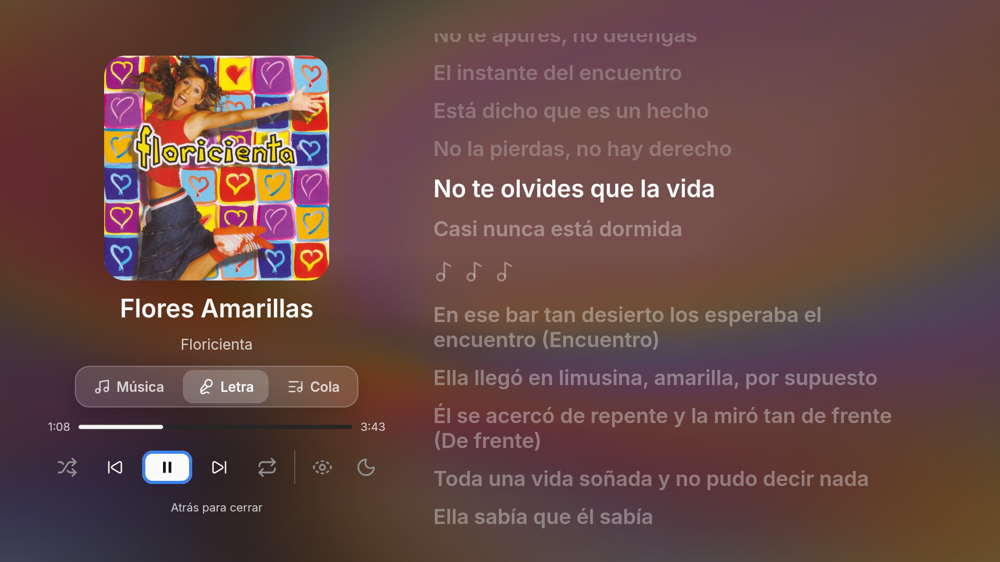
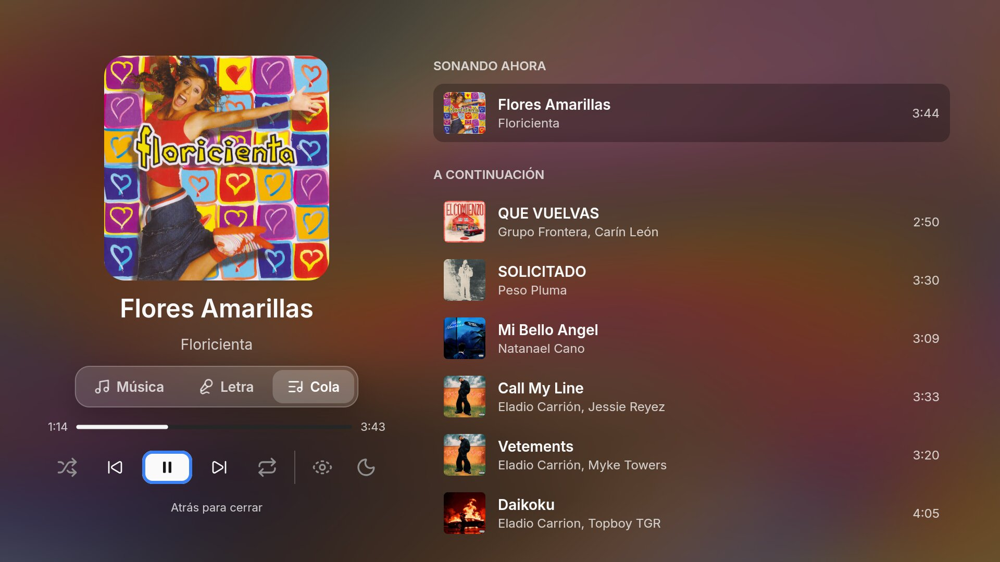
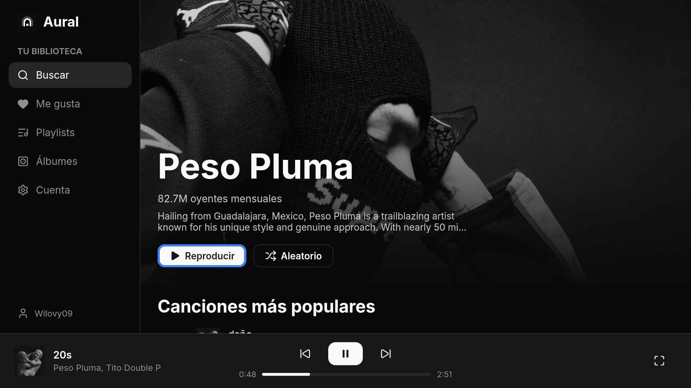
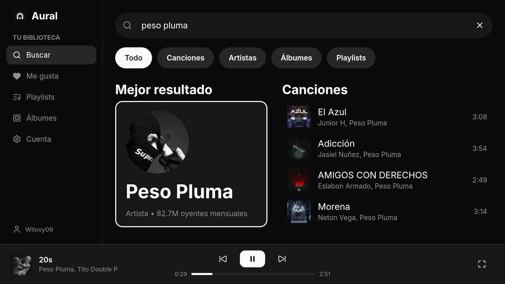
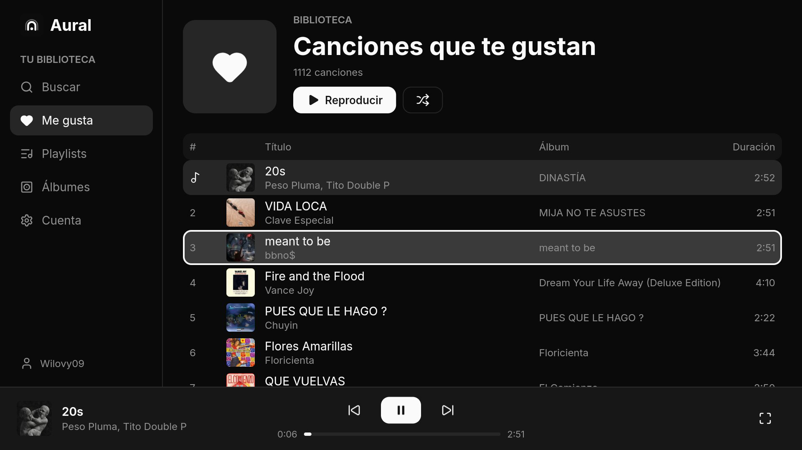
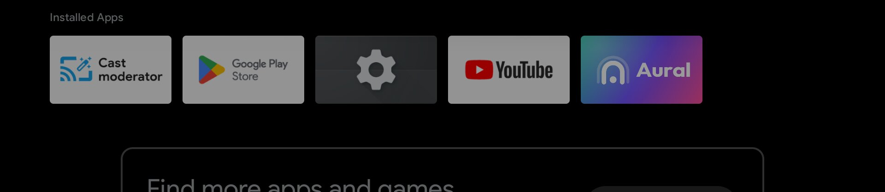

<p align="center">
  
</p>

<p align="center">
  Un cliente de YouTube Music para escritorio, teléfonos Android y Android TV, escrito en Rust con <a href="https://freyaui.dev">Freya</a>.
</p>

<p align="center">
  <a href="README.md">English</a> · <b>Español</b>
</p>

---

## Capturas

<p align="center">
  
</p>

| | |
| --- | --- |
|  |  |
| Letras sincronizadas | Cola |
|  |  |
| Página de artista | Búsqueda |
|  |  |
| Canciones que te gustan | Launcher de Android TV |

## Funciones

- **Tu biblioteca de YouTube Music**: canciones que te gustan, playlists y álbumes, al iniciar sesión con tu cuenta de Google.
- **Búsqueda** de canciones, artistas, álbumes y playlists, con mejor resultado y filtros.
- **Páginas de artista** como en YouTube Music: banner, oyentes mensuales, canciones más populares, álbumes, sencillos, playlists y artistas relacionados.
- **Reproducción en streaming** sin cortes entre canciones, con volumen normalizado, aleatorio y repetir.
- **Letras sincronizadas**: palabra por palabra cuando existen, con los duetos separados por voz. Se buscan primero en Apple Music y luego en LRCLIB, Musixmatch, NetEase, KuGou y YouTube.
- **Portadas animadas** (opcionales), buscadas en Apple Music y decodificadas en el dispositivo.
- **Reproductor a pantalla completa** con fondo animado a partir de la portada, cola, y modos de pantalla limpia y nocturno.
- **Pensado para el control de la TV**: todo funciona con las flechas, OK y Atrás.

## Plataformas

| Plataforma | Estado |
| --- | --- |
| Android TV (Android 9+, ARM de 32 y 64 bits) | Funciona |
| Teléfonos Android | Funciona |
| macOS, Linux, Windows | Abre, pero todavía no se puede iniciar sesión |

## Compilar

Necesitas Rust estable reciente (edición 2024).

### Escritorio

```sh
cargo run --release -p aural
```

### Android

Requisitos: el SDK de Android con NDK, build-tools y CMake, JDK 17, y [`cargo-ndk`](https://github.com/bbqsrc/cargo-ndk):

```sh
cargo install cargo-ndk
rustup target add aarch64-linux-android armv7-linux-androideabi
```

Compila el APK (sin Gradle):

```sh
# Solo ARM de 64 bits (por defecto)
./scripts/android.sh

# Universal: ARM de 64 y 32 bits, para TVs más viejas
./scripts/android.sh arm64-v8a armeabi-v7a
```

El APK queda en `build/aural.apk`, firmado con tu keystore de debug. Instálalo con `adb install -r build/aural.apk`, o cópialo al dispositivo y ábrelo desde un explorador de archivos.

## Controles

| Tecla | Acción |
| --- | --- |
| Flechas / D-pad | Moverse |
| Enter / OK | Seleccionar |
| Esc / Atrás | Regresar |

## Estructura

```
crates/aural    la app: interfaz, navegación, motor de reproducción, biblioteca de YouTube Music
crates/lyrics   búsqueda de letras en varios proveedores, con tiempos por palabra
crates/motion   búsqueda de portadas animadas y el decodificador por hardware de Android
android/        manifest, recursos y los ayudantes en Java (WebView de inicio de sesión, pantalla encendida)
scripts/        compilación y empaquetado para Android
assets/         fuentes, íconos y logos
```

## Créditos

Aural se apoya en el trabajo de:

- [Sonora](https://github.com/sonorahq): interfaz y proveedores de letras
- [Artwork API](https://github.com/boidushya/artwork.boidu.dev) para portadas animadas
- [ytmusic-rs](https://github.com/sonorahq/ytmusic-rs): API de YouTube Music
- [kawarp](https://github.com/better-lyrics/kawarp): fondo animado
- [Freya](https://github.com/marc2332/freya): framework de interfaz
- [Lucide](https://lucide.dev): íconos

Aural no está afiliado a YouTube, Google ni Apple.

## Licencia

[GPL-3.0-or-later](https://www.gnu.org/licenses/gpl-3.0.html)
